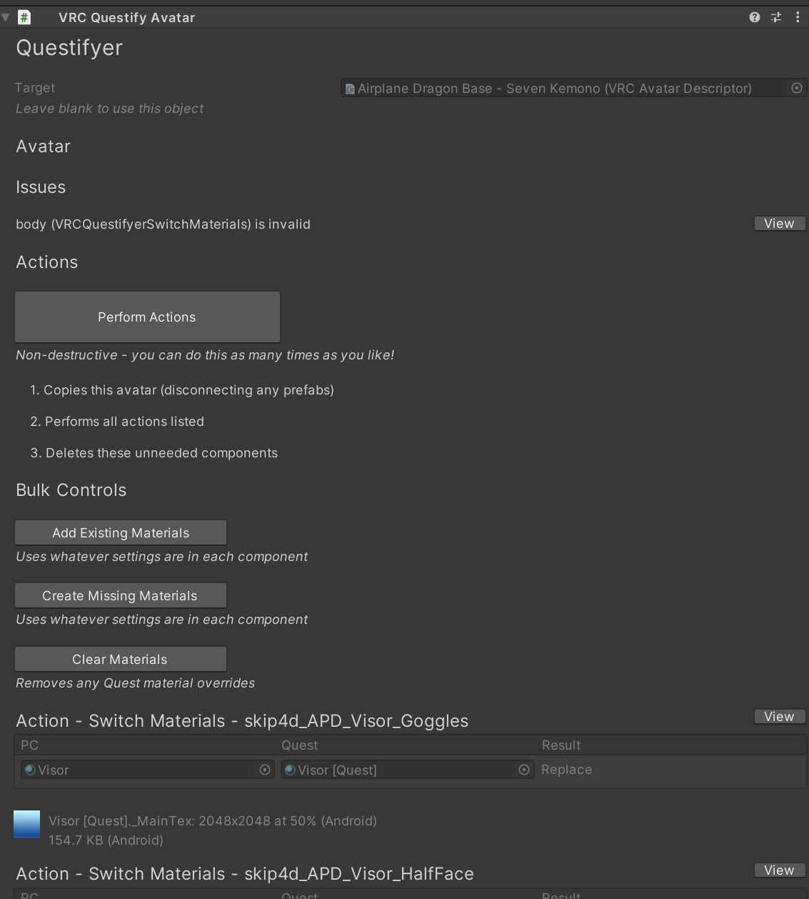
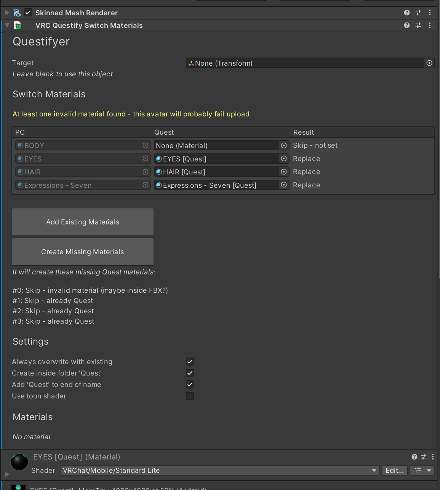
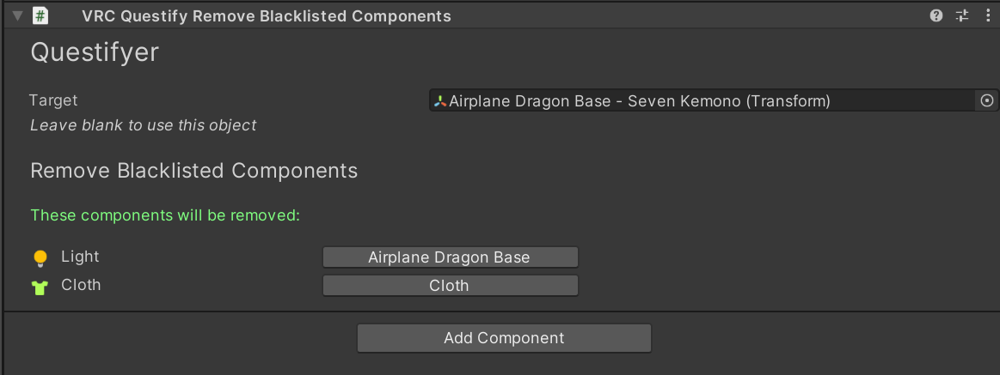
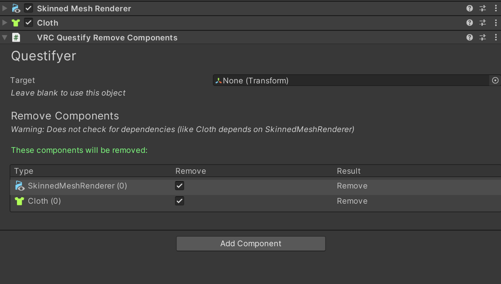
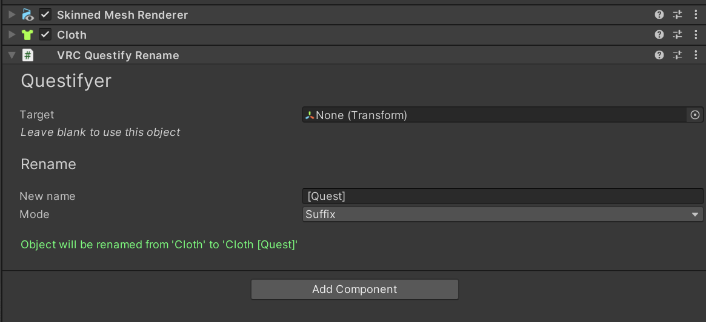

# VRC Questifyer

A Unity plugin that makes it easy to create a Quest version of a VRChat avatar.

It adds special components that you can add to your avatar or anything inside of it which lets you:

- switch materials to Quest-friendly copies
- remove components
- remove blacklisted components (eg. realtime lights)
- rename objects

Tested in Unity 2022.3.22f1 with VRC SDK 3.7.1 (Oct 2024).

## Usage

**Always backup your project before using any 3rd party Unity plugins!**

1. Import Unity package
2. Go to Tools -> PeanutTools -> VRC Questifyer
3. Drag your avatar into the slot and click the big button (it will add an object called Questifyer inside your avatar)
4. Switch to Android, go to the component, click "Perform Actions" and it will do the rest

## Components

### Avatar

The main component. It gives you an overview of all actions found on the avatar and gives you a button to perform everything.

### Switch Materials

Switch materials in each material slot. Create missing Quest materials by copying the existing one. Finds any existing materials.

### Remove Blacklisted Components

Removes any "non-whitelisted" components such as realtime lights, cloth, etc. VRCFury components are ignored.

### Remove Components

Removes a specific component from an object. If multiple components have the same kind, you can specify an index.

### Rename

Renames an object. Optionally adding it as a prefix or suffix.
